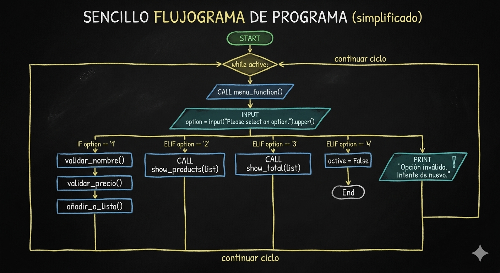

<body>
<header><h1>Inventory_Manager_with_menu</h1></header>

<fieldset>

This is a simple app that works in Console and help you out creating a product Inventory 

- 
Lest say that you have a business and you are buying some couple of products for your stock

- 
Inventory_Manager Help you out creating a list of all the products name, quantity, price and even more, a total spent taking into account all the different classes of products.

--- 

<h2>How it works?</h2>

InventoryManager is splited in four python files every one of them with an important function in the console application: 

---

<legend> <h2>Files Function</h2> </legend>

- <h3>messages.py</h3> 
This is the simples one, it take care of the styled message printed across the app, like the welcome message, the error messages and so on!

- <h3>validation.py</h3> 
This file takes care of the validation error and imports the sytled error messages from messages.py to look comfortable to the 

- <h3>inventory.py</h3> 
This is the principal file in the app because it has the functions that make the application works

- <h3>main.py</h3> 
The main.py file is the place in which we put all the functions together in a loop and in this way the system runs until the client decide to stop.

</fieldset>

---

<h2>Language</h2>

The languange used is Python splited in four files that interact by themselve across the application 

 
<body>

---

<h3>Chartflow</h3>

<h2>Author</h2>

Luis Reyes Caro  
Software Developer in Training
